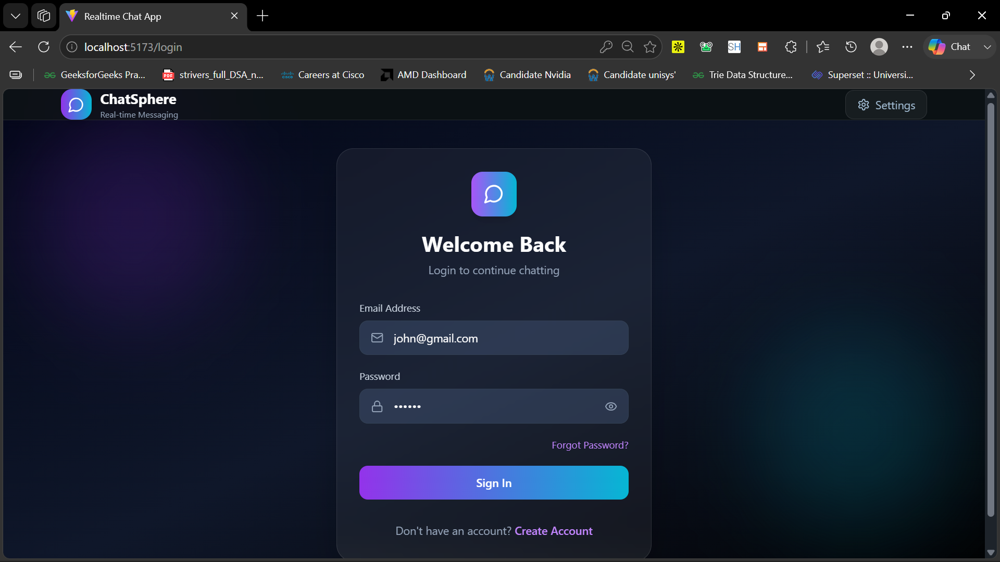
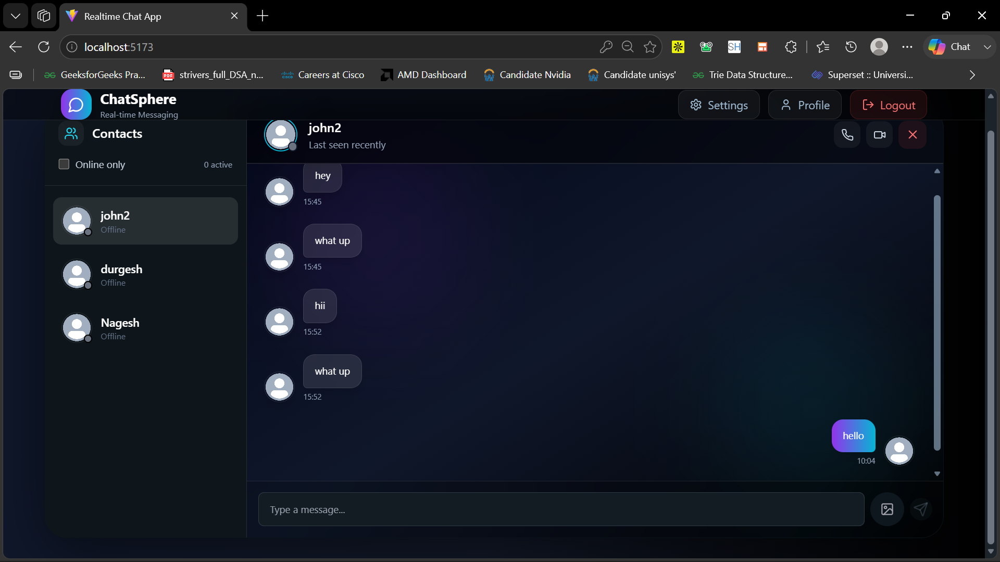
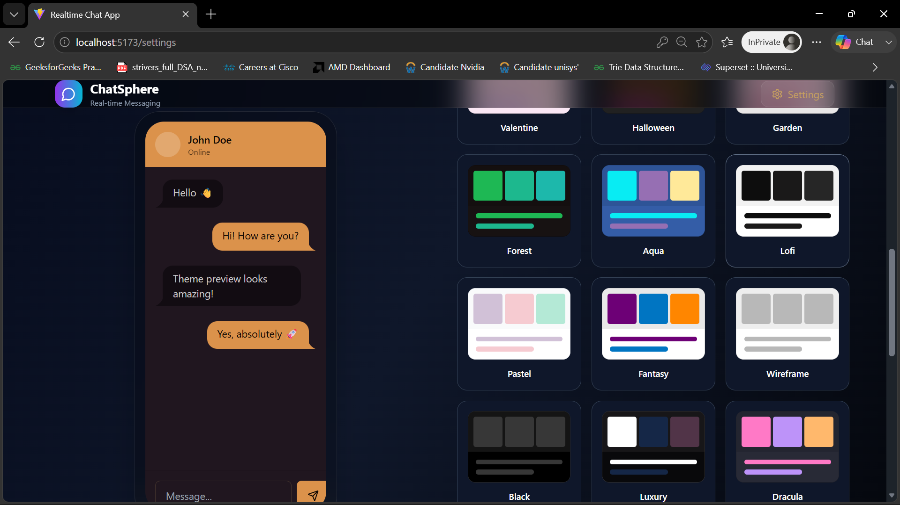
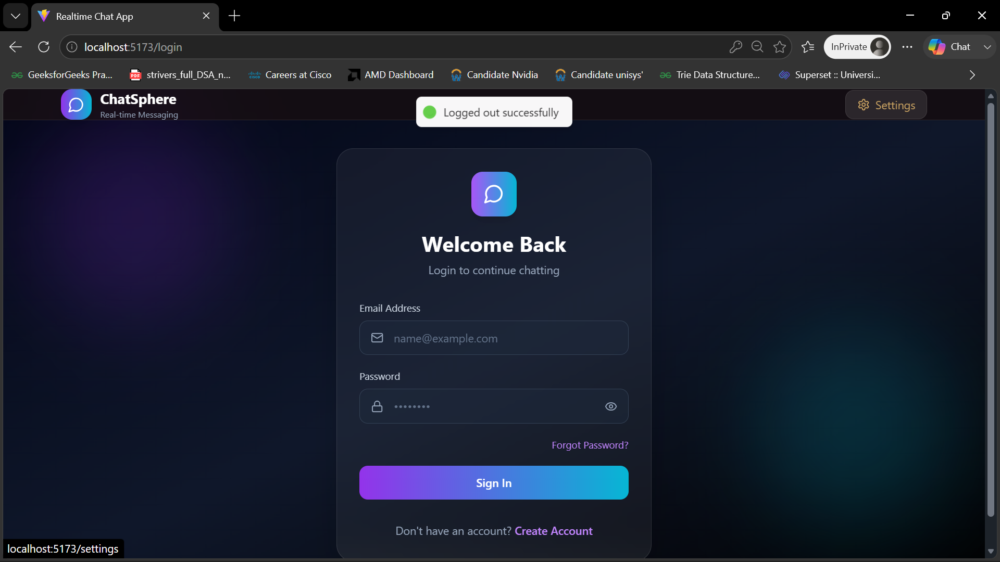

# 🚀 RealTimeChat - Full Stack Real-Time Messaging Platform

<p align="center">
  
</p>

<p align="center">
  <strong>A Modern Full-Stack Real-Time Chat Application Built with React, Node.js, Socket.io, MongoDB, Docker, and Nginx.</strong>
</p>

<p align="center">
  
  
  
  
  
  
</p>

---

# 🌟 Overview

RealTimeChat is a scalable real-time messaging platform that enables users to communicate instantly through secure WebSocket connections.

The project follows a production-oriented architecture using:

* ⚛️ React + Vite Frontend
* 🚀 Node.js + Express Backend
* 🔌 Socket.IO for Real-Time Communication
* 🍃 MongoDB Atlas Database
* 🐳 Docker Containerization
* 🌐 Nginx Reverse Proxy
* 🔐 JWT Authentication
* 🗄️ Zustand State Management
* 🎨 Tailwind CSS + DaisyUI

---

# 🎯 Key Features

## 💬 Real-Time Messaging

* Instant message delivery
* Socket.IO powered communication
* Live updates without page refresh

## 🔐 Authentication & Authorization

* JWT Based Authentication
* Secure Protected Routes
* Persistent User Sessions

## 👤 User Profiles

* Update Profile Information
* Upload Profile Pictures
* Personalized User Experience

## 🟢 Online Presence

* Real-Time Online Status
* Active User Tracking
* Live Connection Monitoring

## 🎨 Modern UI/UX

* Responsive Design
* Multiple Theme Support
* Mobile Friendly Interface
* Smooth Animations

## 🐳 Docker Support

* Frontend Container
* Backend Container
* Easy Deployment
* Production Ready Configuration

---

# 🏗️ System Architecture

```text
c:\Users\kumar\Downloads\Gemini_Generated_Image_4at8544at8544at8.png
```

---

# ⚡ Technology Stack

## Frontend

* React
* Vite
* Zustand
* Tailwind CSS
* DaisyUI
* Axios
* React Router DOM
* React Hot Toast

## Backend

* Node.js
* Express.js
* Socket.IO
* Mongoose
* JWT
* bcryptjs
* Cloudinary

## Database

* MongoDB Atlas

## DevOps

* Docker
* Nginx
* Docker Compose

---

# 📂 Project Structure

```bash
RealTimeChat/
│
├── frontend/
│   ├── src/
│   ├── public/
│   ├── Dockerfile
│   └── nginx.conf
│
├── backend/
│   ├── src/
│   │   ├── controllers/
│   │   ├── routes/
│   │   ├── middleware/
│   │   ├── models/
│   │   └── lib/
│   └── Dockerfile
│
├── docker-compose.yml
│
└── README.md
```

---

# 🔧 Environment Variables

Create a `.env` file inside the backend folder.

```env
PORT=5000

MONGO_URI=your_mongodb_atlas_uri

JWT_SECRET=your_super_secret_key

CLOUDINARY_CLOUD_NAME=your_cloud_name

CLOUDINARY_API_KEY=your_api_key

CLOUDINARY_API_SECRET=your_api_secret

NODE_ENV=production
```

---

# 🚀 Local Development Setup

## Clone Repository

```bash
git clone https://github.com/Nageshkumar01/RealTimeChat.git

cd RealTimeChat
```

---

## Backend Setup

```bash
cd backend

npm install

npm run dev
```

Backend:

```text
http://localhost:5000
```

---

## Frontend Setup

```bash
cd frontend

npm install

npm run dev
```

Frontend:

```text
http://localhost:5173
```

---

# 🐳 Docker Deployment

## Build Images

### Frontend

```bash
cd frontend

docker build -t realtimechat_frontend .
```

### Backend

```bash
cd backend

docker build -t realtimechat_backend .
```

---

# 🐳 Docker Compose (Recommended)

Start everything with a single command:

```bash
docker compose up -d --build
```

Stop all services:

```bash
docker compose down
```

---

# 🌍 Production Deployment

The application can be deployed on:

* Render
* Railway
* AWS EC2
* DigitalOcean
* Azure
* Google Cloud
* Kubernetes (Future Enhancement)

---

# 📸 Application Screenshots

## Login Page


---

## Chat Interface



---

## Settings Page



---

## Logout Screen



---

# 🔮 Future Enhancements

* [ ] Group Chats
* [ ] Voice Messages
* [ ] Video Calling
* [ ] Message Reactions
* [ ] Read Receipts
* [ ] Push Notifications
* [ ] Kubernetes Deployment
* [ ] CI/CD Pipelines
* [ ] End-to-End Encryption
* [ ] AI Chat Assistant

---

# 🤝 Contributing

Contributions are welcome!

1. Fork the repository
2. Create a feature branch

```bash
git checkout -b feature/new-feature
```

3. Commit your changes

```bash
git commit -m "Added new feature"
```

4. Push to GitHub

```bash
git push origin feature/new-feature
```

5. Open a Pull Request

---

# 👨‍💻 Author

### Nagesh Kumar

Computer Science Engineering Student

GitHub:
https://github.com/Nageshkumar01

Project Repository:
https://github.com/Nageshkumar01/RealTimeChat

---

# ⭐ Support

If you found this project useful:

⭐ Star the repository

🍴 Fork the repository

🐛 Report issues

🚀 Contribute improvements

---

## Made with ❤️ using React, Node.js, Socket.IO, MongoDB, Docker, and Nginx.
